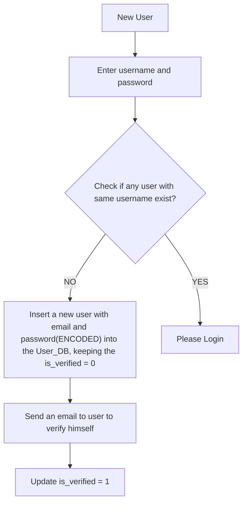

This project uses Spring Hibernate , authentication , pagination and all other advanced features.

***
**User authentication**

Our application should be stateless , means any new request should be self sufficient and can go to any of the servers.


#####User registration

registration(email/mobileNumber, password)

Steps :

 1. User is created with the given email/mobile number and password
 2. User will get a link to verify himself(Just to ensure that we don't login using someone else's email/mobile number).
 3. Once verification completes, user can login into the platform.
 
 What do in server side while creating a new user 
 
 ```
 | user_id | password                         |            | is_verified  |  -- created,.... 
| --------|:---------------------------------:| --------   | -----------: |
| 1       | AT5YlsuA2g8cKlg4VSWrtuILSD5r2vG2  |  x@abc.com |       0      |
| 2       | qEmz4Ltwmse43VPWm84yshUWZATyz28a  | nx@abc.com |       0      |
| 3       | qEmz4Ltwmse43VPWm84yshUWZATyz28a  | px@bub.com |       1      |
 
 ```
 
    1. We create a new entry into users table 
    2. Keep the is_verified column = 0
    3. When user verifies himself , we update is_verified = 1;
    4. Once verified , user can login into the platform
    
#####How User passwords are handled?

#####Possible solutions : 

**Encode the password** - When you encode the password , for example 
A is converted to 9X4DE
B is converted to XPUi7
 .. 
 
So when a user gives a password, we encode it and save to the db.

Suppose someone's password is xyz@is32  and it's encoded to XFSEDE^&67HfGGs.

While login with the same email password, we again **encode the incoming password and compare it with the password saved in the db**. if it's matches , we are all set .


**This sounds secure , isn't it ?**

**Problem with this approach**

Most frequently used password 
eg :
  
  “123456”,
 “123456789”,
 “qwerty”,
 “password”,
 and “111111”


Suppose somehow the database is leaked, 

The hacker will try login to the portal with these common passwords and see what is the respective encoded value.

Once she has these encoded value , it can login with all the users who are using these common password 

**Select * from  User_DB where password In ENCODED VALUE(most commonly used passwords)**

so all those user are hacked. 

Solution : We need an encoding system which gives **different value for same input**. 
This creates another issue ...How will we verify an user while login ?

There comes another famous algorithm to handle this as well BCrypt

**How does BCrypt works ?[Link text] (https://bcrypt-generator.com/) **

It gives different value for same input :
eg : xyz@1234 -- Will have different hashed value every time I generate a BCrypt password for this password.

While login we will pass the same password xyz@1234, 

also as we know **we can not decrypt a hashed value back to the original password , how it will validate ? or match it from the stored password?**

BCrypt provides a method called **matches** which verifies if the stored password can be generated using the original password..then user can login otherwise login fails.


```java 

signUp(String email, String password){
 String hashedPassword = BCryptasswordEncoder.encode(password);
 saveToDB(email, hashedPassword);
}

login(String email, String password){
Employee emp = employeeService.findEmployeeByEmail(email);
if(emp == null) return null; 
if(BCryptPaswordEncoder.matches(emp.hashedPassword, password)) return emp;

```


#####User Login 

Login(email, password)

Server Side

```java
AuthController.java
@PostMapping("/login")
login(@RequestBody LoginInfo requestBody){
   String email = requestBody.getEmail();
   String password = requestBody.getPassword();
   
   1.Check if any user with same email id exists in the db
   Employee loggedInEmployee = authService.login(email, password);
   if(loggedInEmployee == null){
     throw new RuntimeException("Incorrect Credentials");
   }  
   return loggedInEmployee;
}

               2. If not found throw error "Incorrect Credentials"
               3. If user found 
                  a. Check the password 
                  b. if password does not match , throw error "Incorrect Credentials"
                  c. if password matches , return user details , let the user Login
```
Any upcoming requests , **say getEmployeeSalary(empId)** -- will need to verified if user is loggedIn into the platform , before fetching the Salary details.

One way to fix this is to pass the email and password to all the APIs.so the actual call to
getEmployeeSalary(email, password) -- will be 

```java 

@GetMapping("/salary")
public Salary getEmployeeSalary(String email, String password){

	Employee loggedInEmployee = authService.login(email, password);

	if(loggedInEmployee!= null)
	  // All the logic to get the salary of the given employee
	  Salary salary = employeService.getSalary(loggedInEmployee.getId());
	  return salary;
	}
	return null;
	


```

So we will need to call the Login(email, password) before getting the Salary for the employee.

**Problem with this approach** 

This will add additional overhead of loggin in the users , which is not ideal in cases where we have huge customer base and will eventually become a bottleneck when we try to scale the product.

** What should we do ? **

We can modify our login service to return a token instead . How will that help ? Let's **deep dive** 

We will need additional table to keep a track of Tokens assigned to a user 


```md


| user_id | token                             | created_at  |
| --------|:---------------------------------:| -----------:|
| 1       | AT5YlsuA2g8cKlg4VSWrtuILSD5r2vG2  |             |
| 2       | qEmz4Ltwmse43VPWm84yshUWZATyz28a  |             |
| 2       | qEmz4Ltwmse43VPWm84yshUWZATyz28a  |             |


```


Steps -
 
 1. When there is a successful login, we add an entry to users_token table
 2. Upcoming requests will have this token either as a request parameter or in header
 3. We verify the token against the list of tokens available for that user   
 4. If it matches any token , we return the requested data
 5. Otherwise we will notify the client to login.
  


```java

public String login(@RequestBody LoginInfo requestBody){
   String email = requestBody.getEmail();
   String password = requestBody.getPassword();
   
   1.Check if any user with same email id exists in the db
   String authToken = authService.login(email, password);
   if(authToken == null){
     throw new RuntimeException("Incorrect Credentials");
   }  
   return authToken;
}

```

Same 

