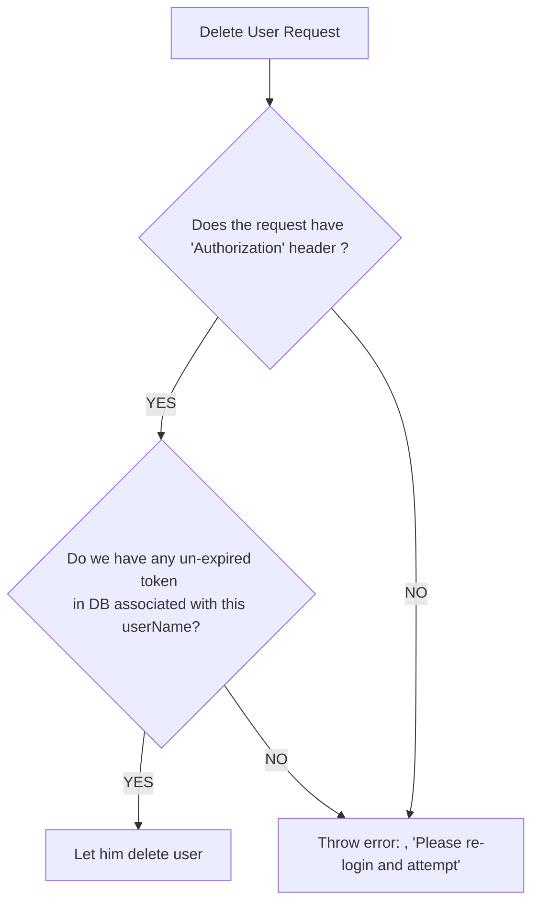

This project uses Spring Hibernate , authentication , pagination and all other advanced features.

***
**User authentication**

Any authentication request should be stateless , means any new request should be self sufficient and can go to any of the available servers.


#####User registration

registration(email, password)

Steps :

 1. User is created with the given email and password
 2. User will get a link to verify himself(Just to ensure that we don't signUp using someone else's email).
 3. Once verification completes, user can login into the platform.
 
 What do we do in server side while creating a new user 
 
 ```
 | user_id | password                         |            | is_verified  |  -- created,.... 
| --------|:---------------------------------:| --------   | -----------: |
| 1       | AT5YlsuA2g8cKlg4VSWrtuILSD5r2vG2  |  x@abc.com |       0      |
| 2       | qEmz4Ltwmse43VPWm84yshUWZATyz28a  | nx@abc.com |       0      |
| 3       | qEmz4Ltwmse43VPWm84yshUWZATyz28a  | px@bub.com |       1      |
 
 ```
 
    1. We create a new entry into users table 
    2. Keep the is_verified column = 0
    3. When user verifies himself , we update is_verified = 1;
    4. Once verified , user can login into the platform
    
#####How User passwords are handled?

#####Possible solutions : 

**Encode the password** - When you encode the password , for example 
A is converted to 9X4DE
B is converted to XPUi7
 .. 
 
So when a user gives a password, we encode it and save to the db.

Suppose someone's password is xyz@is32  and it's encoded to XFSEDE^&67HfGGs.

While login with the same email password, we again **encode the incoming password and compare it with the password saved in the db**. if it's matches , we are all set .


**This sounds secure , isn't it ?**

**Problem with this approach**

Below are few most frequently used password 
eg :
  
 1. “123456”,
 2. “123456789”,
 3. “qwerty”,
 4. “password”,
 5. and “111111”


Suppose some how the database is leaked, 

The hacker will try login to the portal with these common passwords and see what is the respective encoded value.

Once she has these encoded value , she can login with all the users who are using these common password 

**Select * from  User_DB where password In ENCODED VALUE(most commonly used passwords)**

So all those user are hacked. 

Solution : We need an encoding system which gives **different value for same input. 
This creates another issue ...How will we verify an user while login ?**

There comes another famous algorithm to handle this as well BCrypt

**How does BCrypt works ?[Link text] (https://bcrypt-generator.com/) **

It gives different value for same input :
eg : xyz@1234 -- Will have different hashed value every time I generate a BCrypt password for this password.

While login we will pass the same password xyz@1234, 

Also as we know **we can not decrypt a hashed value back to the original password , how it will validate ? or match it from the stored password?**

BCrypt provides a method called **matches** which verifies if the stored password can be generated using the original password..then user can login otherwise login fails.


```java 
signUp(String email, String password){
 String hashedPassword = BCryptasswordEncoder.encode(password);
 saveToDB(email, hashedPassword);
}

login(String email, String originalPassword){
	Employee employee = employeeService.findEmployeeByEmail(email);
	if(employee == null) return null; 
	if(BCryptPaswordEncoder.matches(originalPassword, emp.getPassword()) return employee;
}
```
1. Add Maven dependency 
2. Encode the Password on sign up 
3. Match the Password on login

**1. Add Maven Dependency**

```
<dependency>
	<groupId>org.springframework.boot</groupId>
	<artifactId>spring-boot-starter-security</artifactId>
</dependency>
```
Once we add these dependencies, we start getting on login page on hitting ** http://localhost:8080.**

We don't want to use this default Spring Security Configuration so we will need to override this default 
behaviour. ** How to do that ?**

Create a configs folders and a class SpringSecurityConfig.java 

Add class level annotation of @Configuration
 
**@Configuration is a powerful annotation that plays a central role in defining and managing beans in Spring Boot applications **

Here's a breakdown of what @Configuration does:

**Indicates Bean Definitions**:  A class annotated with @Configuration tells Spring Boot that this class contains one or more methods that define beans. These methods are typically annotated with @Bean.

**Spring IoC Container Integration**: The @Configuration annotation essentially instructs the Spring IoC container to process the class during application startup. This processing involves creating bean instances and managing their lifecycles.

**Convention Over Configuration**: Spring Boot follows the convention over configuration principle. This means that with @Configuration, you can define beans in a concise and declarative way, reducing the need for extensive XML configuration files.


**What are we gonna do in this file to override the default behaviour of Spring Security?**

Define a bean for SecurityFilterChain

```
   @Bean
	public SecurityFilterChain securityFilterChain(HttpSecurity httpSecurity) throws Exception                   
	{
		httpSecurity.cors().disable();
		httpSecurity.csrf().disable();
		httpSecurity.authorizeHttpRequests(authorise -> authorise.anyRequest().permitAll());
		return httpSecurity.build();
	}
```
---
**2. Encode the Password on signUp** 

 @Autowire BCryptPasswordEncoder in BCryptAuthServiceImpl.java file
 
```java 

   @Autowired
	private BCryptPasswordEncoder bCryptPasswordEncoder;
```

Modify signUp method to have password encoded before saving to DB

```java
   @Override
	public User signUp(String userName, String password) {
		Optional<User> savedUser = authServiceWithoutTokenRepository.findByEmail(userName);
		if (savedUser.isPresent()) {
			return savedUser.get();
		}
		return authServiceWithoutTokenRepository
				.save(new User(null, userName, bCryptPasswordEncoder.encode(password), (byte)    0));
	}
```

**Looks Good ? should signUp work now ?**

```
***************************
APPLICATION FAILED TO START
***************************

Description:

Field bCryptPasswordEncoder in com.example.em.services.BCryptAuthServiceImpl required a bean of type 
'org.springframework.security.crypto.bcrypt.BCryptPasswordEncoder' that could not be found.

The injection point has the following annotations:
	- @org.springframework.beans.factory.annotation.Autowired(required=true)
	- @org.springframework.beans.factory.annotation.Qualifier("BCryptAuthServiceImpl")
```
**Consider defining a bean** of type 'org.springframework.security.crypto.bcrypt.BCryptPasswordEncoder'
in your configuration.

**Why do we need to define a bean for BCryptPasswordEncoder in configuration file even after defining it in the pom.xml file?**

Adding the dependency provides the class definition.

Creating a @Bean method tells Spring Boot to create and manage an instance of that class as a bean.

Now it works finally 

BCryptAuthServiceImpl.java

```
   @Autowired
	private BCryptPasswordEncoder bCryptPasswordEncoder;

	@Override
	public User signUp(String userName, String password) {
		Optional<User> savedUser = authServiceWithoutTokenRepository.findByEmail(userName);
		if (savedUser.isPresent()) {
			return savedUser.get();
		}
		return authServiceWithoutTokenRepository
				.save(new User(null, userName, bCryptPasswordEncoder.encode(password), (byte)  0));
	}
```
---
**3. Match the Password on login**

```
   @Autowired
	private BCryptPasswordEncoder bCryptPasswordEncoder;

	@Override
	public Optional<User> login(String userName, String password) {
		Optional<User> savedUser = authServiceWithoutTokenRepository.findByEmail(userName);
		if (savedUser.isPresent() && bCryptPasswordEncoder.matches(password, savedUser.get().getPassword())) {
			return savedUser;
		}
		throw new RuntimeException("Incorrect Credentials");
	}
```

---
**Understanding Token-Based Authentication**

An authentication token (auth token) is a computer-generated code that verifies a user’s identity. Auth tokens are used to access websites, applications, services, and application programming interfaces (APIs). They allow users to access these resources without having to re-enter their login credentials each time they visit.

Auth tokens are encrypted and machine-generated. They can be expired or revoked, which provides better protection against attack scenarios like brute-force attacks or stolen passwords.

#####User Login 
Login seems fine but what about other resources? Should we have any authentication as resource level as well.

If yes , how we are going to implement this?

Any upcoming requests eg: **deleteEmployee(empId)** 

One way to fix this is to pass the **email and password** to all the APIs.So the actual call to
deleteEmployee(email, password)

```java 
@GetMapping("/delete/{id}")
public void deleteEmployee(String email, String password){
	Employee loggedInEmployee = authService.login(email, password);
	if(loggedInEmployee!= null)
	  // All the logic to get the salary of the given employee
	  employeService.delete(loggedInEmployee.getId());
	}
	return null;
}
```

So we will need to call the Login(email, password) before deleting the employee.

**Problem with this approach** 

This will add additional overhead of login in the users , which is not ideal in cases where we have huge customer base and will eventually become a bottleneck when we try to scale the product.

** What should we do ? **

We can modify our login service to return a token instead . How will that help ? Let's **deep dive** 

We will need additional table to keep a track of Tokens assigned to a user 


```md
| user_id | token                             | created_at       |
| --------|:---------------------------------:| ----------------:|
| 1       | AT5YlsuA2g8cKlg4VSWrtuILSD5r2vG2  | currentTimestamp |
| 2       | qEmz4Ltwmse43VPWm84yshUWZATyz28a  | currentTimestamp |
| 2       | qEmz4Ltwmse43VPWm84yshUWZATyz28a  | currentTimestamp |
```


Steps -
 
 1. When there is a successful login, we add an entry to users_token table. I am using the BCrypted key as a token.
 2. Upcoming requests will have this token either as a request parameter or in header
 3. We verify the token against the list of tokens available for that user   
 4. If it matches any token , we return the requested data
 5. Otherwise we will notify the client to login.
  

```java

	 AuthServiceWithTokenImpl.java


    @Override
	public Optional<User> login(String userName, String password) {
		Optional<User> savedUser = userRepository.findByEmail(userName);
		if (savedUser.isPresent() && bCryptPasswordEncoder.matches(password, savedUser.get().getPassword())) {
			// The actual token can be different , right now I am using the encoded password
			// itself
			UserTokens tokens = new UserTokens(null, savedUser.get().getId(), savedUser.get().getPassword(),  userName,
					LocalDate.now(), LocalDate.now().plus(1, ChronoUnit.DAYS));
			userTokensRepository.save(tokens);
			return savedUser;
		}
		throw new RuntimeException("Incorrect Credentials");
	}
	
	
	@Override
	public boolean isValidToken(String token, String email) {
		Optional<UserTokens> userToken = userTokensRepository.findByTokenAndEmail(token, email);
		return userToken.isPresent() && userToken.get().getExpiredBy().isAfter(LocalDate.now());
	}

    EmployeeController.java

    @DeleteMapping("/delete/{id}")
	public ResponseEntity<ApiResponseDTO> deleteEmployee(@PathVariable("id") Long empId,
			@RequestHeader("Authorization") String token) {

		Optional<Employee> employeeOptional = employeeService.getEmployee(empId);
		if (empId == null || !employeeOptional.isPresent()) {
			throw new IllegalArgumentException("Invalid Id. Cannot delete non-existing employee.");
		}
		boolean isValidToken = authService.isValidToken(token, employeeOptional.get().getEmail());
		if (!isValidToken) {
			throw new IllegalArgumentException("Invalid session. Please re login.");
		}
		employeeService.deleteEmployee(empId);
		ApiResponseDTO apiResponseDTO = new ApiResponseDTO("Deleted successfully", null, null);
		return new ResponseEntity<ApiResponseDTO>(apiResponseDTO, HttpStatus.OK);
	}
```

We just validate the request header before deleting the employee. Below is the flow chart.



But, this approach also requires to check it in user_token table so no optimization in terms of numbers of request . We can have cache and all but we don't want to make one db call(fetch tokens from user_token table).

We are looking for a token , after looking at it the server will come to know if it's valid or not. i.e : SELF VALIDATING Token.

**What exactly we are looking for?**

Step 1 : Create a Token when user logs into the system  -- This remains unchanged 
Step 2 : To verify the token sent by the user in subsequent request takes one additional DB class -- We need this to be optimized

Somehow we need to remove this extra db call.

What if somehow we can store all the required information in token itself.When we need to verify it , we willl fetch the data from token itself.

eg   
     
     tokenInfo = { 
       "user_id":"uiv7i6",
       "email" : "gangadharnbn@gmail.com"
       "tokenValue" : "YTviuybuikyvyiubiu2ugob87b7gb"
       "expired_by":"futuretimestamp",
       "roles":[...,...,...]
      }

We need this token to pass over the network , so we need to encrypt this as well.

Use Base64 encoding to enocde the tokenInfo

```
 encodedToken= Base64.encode(tokenInfo)
```
     
Finally , this encodedToken can be sent over the network 

for deleteEmployee -- we are passing this encodedToken in header 

```
	 @DeleteMapping("/delete/{id}")
	public ResponseEntity<ApiResponseDTO> deleteEmployee(@PathVariable("id") Long empId,
			@RequestHeader("Authorization") String token) {
          String decodedToken = Base64.decode(token);// It would return a json String
          
          String userId = decodedToken.user_id;
          String email = decodedToken.email; 
          LocalDate expiredBy = decodeToken.expired_by;   
	}
```


Here comes ** JWT(JSON web Tokens) ** 

What is JSON Web Token?
JSON Web Token (JWT) is an open standard (RFC 7519) that defines a compact and self-contained way for securely transmitting information between parties as a JSON object. This information can be verified and trusted because it is digitally signed. JWTs can be signed using a secret (with the HMAC algorithm) or a public/private key pair using RSA or ECDSA.

Although JWTs can be encrypted to also provide secrecy between parties, we will focus on signed tokens. Signed tokens can verify the integrity of the claims contained within it, while encrypted tokens hide those claims from other parties. When tokens are signed using public/private key pairs, the signature also certifies that only the party holding the private key is the one that signed it.

**When should you use JSON Web Tokens?**


Here are some scenarios where JSON Web Tokens are useful:

 1. **Authorization**: 
This is the most common scenario for using JWT. Once the user is logged in, each subsequent request will include the JWT, allowing the user to access routes, services, and resources that are permitted with that token.

 2. Information Exchange: 
JSON Web Tokens are a good way of securely transmitting information between parties. Because JWTs can be signed—for example, using public/private key pairs—you can be sure the senders are who they say they are. Additionally, as the signature is calculated using the header and the payload, you can also verify that the content hasn't been tampered with.


**What is the JSON Web Token structure?**

In its compact form, JSON Web Tokens consist of three parts separated by dots (.), which are:

```
  1. Header
  2. Payload
  3. Signature
```

Therefore, a JWT typically looks like the following.

xxxxx.yyyyy.zzzzz

Let's break down the different parts.

**Header**

The header typically consists of two parts: the type of the token, which is JWT, and the signing algorithm being used, such as HMAC SHA256 or RSA.

For example:

```
	{
	  "alg": "HS256",
	  "typ": "JWT"
	}
```
Then, this JSON is Base64Url encoded to form the first part of the JWT.

**Payload**

The second part of the token is the payload, which contains the properties.

```
iss (issuer),
exp (expiration time), 
sub (subject), 
aud (audience), etc 
```

An example payload could be:

```json
{
  "sub": "1234567890",
  "name": "John Doe",
  "admin": true
}
```

The payload is then **Base64Url** encoded to form the second part of the JSON Web Token.


**Signature**

To create the signature part you have to take the **encoded header, the encoded payload**, a secret, the algorithm specified in the header, and sign that.

For example if you want to use the HMAC SHA256 algorithm, the signature will be created in the following way:

```json
HMACSHA256(
  base64UrlEncode(header) + "." +
  base64UrlEncode(payload),
  secret)
  
```

The signature is used to verify the message wasn't changed along the way, and, in the case of tokens signed with a private key, it can also verify that the sender of the JWT is who it says it is.


 


